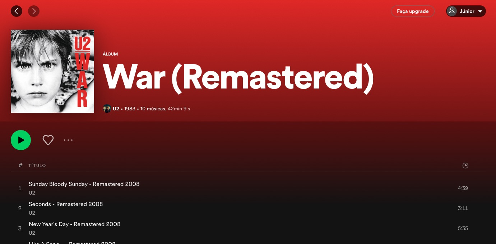

# Acid Spotify Version - Browser App like Chrome
<h2>Para MacOS, Windows & Linux

## Novidades:

- Removido todas as propagandas
- Sem a necessidade de pular anúncios
- Removidos os botões premium e install😁

  
## Com instalar

1. Clone ou faça o download deste repositório em uma pasta.
1. Vá para chrome://extensions
2. Esteja no **Modo Desenvolverdor** (No canto superior direito) tem que estar ativado.
3. Arraste & solte a pasta contendo este scrit lá.
4. Abra o Spotify Web e depois vá no Chrome em `Opções > Mais Ferramentas > Criar Atalho...`
5. CLique em `Abrir como uma janela` & clique em Criar
6. Abra o Spotify como um App
7. Não a pasta do scritp, pois o spotify deixa de funcionar.
